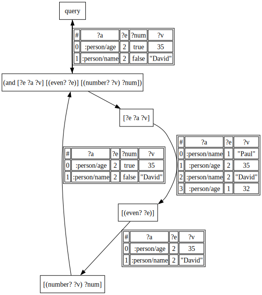

## Datatonic


A tonic for what ails me.

Also, an exploration of triple stores and query planning, explaining, optimization, and execution.


---

### Visualization

Datatonic supports generating a graphviz diagram of the execution of a datalog query. All intermediate relations are included in the diagram making this a powerful debugging tool.

```clojure
(require '[io.github.rutledgepaulv.datatonic.index :as index])
(require '[io.github.rutledgepaulv.datatonic.visualize :as viz])


(def datoms
 [[1 :person/name "Paul"]
  [1 :person/age 32]
  [2 :person/name "David"]
  [2 :person/age 35]])

(def db (reduce index/add-datom (index/new-db) datoms))

(viz/visualize* db
 '[:find ?e ?a ?v
   :where
   [?e ?a ?v]
   [(even? ?e)]
   [(number? ?v) ?num]])
```



---

### References

- [Datomic Query Reference](https://docs.datomic.com/query/query-data-reference.html)
- [Relational Theory for Computer Professionals: What Relational Databases Are Really All About](https://isbndb.com/book/9781449369439)

---

### Prior Art
- [datascript](https://github.com/tonsky/datascript)
- [datomic](https://docs.datomic.com/datomic-overview.html)
- [datalevin](https://github.com/juji-io/datalevin)
- [datahike](https://github.com/replikativ/datahike)
